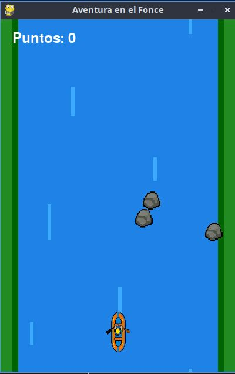
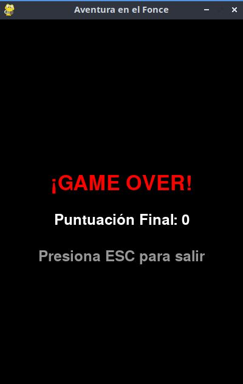

# Aventura en el fonce
## Descripción del Juego

Aventura en el Fonce es un videojuego arcade de agilidad en 2D desarrollado en Python utilizando la librería Pygame. El juego está inspirado en los deportes extremos de nuestra región en San Gil, Santander.

El jugador toma el control de una balsa de rafting (con vista aérea o cenital) que navega por el Río Fonce. El objetivo principal es esquivar las rocas y obstáculos que caen desde la parte superior de la pantalla arrastrados por la fuerte corriente.

A medida que el jugador sobrevive, el tiempo corre y la velocidad de los obstáculos aumenta de forma progresiva, elevando la dificultad del juego. El juego termina inmediatamente si la balsa colisiona con alguna roca. ¡El objetivo es aguantar el mayor tiempo posible y conseguir la puntuación más alta!

## Características Principales

- Estilo Visual: Gráficos retro en estilo Pixel con vista desde arriba.
Ambientación Local: Fondo dinámico que simula el Río Fonce y los bordes verdes inspirados en los árboles de Ceiba del Parque El Gallineral.

- Mecánica Simple: Movimiento fluido de izquierda a derecha (Eje X) usando las flechas del teclado.
Dificultad Progresiva: Sistema de aceleración matemática que aumenta la velocidad de los obstáculos a medida que sube el puntaje.

## Propósito Pedagógico

Este proyecto fue diseñado con el fin de enseñarles a estudiantes de sexto grado los fundamentos de la programación y las matemáticas de una manera divertida, explicando conceptos como:

- El Plano Cartesiano: Uso de coordenadas (X, Y) para el movimiento y la detección de colisiones.

- El Bucle Principal (Game Loop): El ciclo de vida de un juego (Leer controles \rightarrow Actualizar lógica \rightarrow Redibujar pantalla).

- Manejo de Variables: Modificación de variables de velocidad en tiempo real

# GUIA DE USUARIO
- el juegador comiensa situado en el centro de la pantalla
- se puede observar que controlamos una balsa de rafting que navega por el rio Fonce y hay que evitar que choquemos con las rocas
- tambien se observa que en la parte superior izquierda de la pantalla nos muestra los puntos que hemos obtenido

- la balsa se controla con flecha derecha izquierda o con las teclas A,D
- tambien nos muestra al chocar con una roca la pantalla de game over y los puntos que obtubimos

## Presentacion
https://notebooklm.google.com/notebook/f334b9a2-cbd8-4ac6-b5d4-dba8eef775c3/artifact/34b0ba25-1ea0-4c1f-a5bf-595cd58b6104?utm_source=nlm_web_share&utm_medium=google_oo&utm_campaign=art_share_2&utm_content=&utm_smc=nlm_web_share_google_oo_art_share_2_